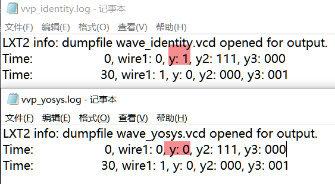

## Incorrect Right Shift Operation in Yosys

### Version
Yosys 0.39+165

### On which OS did this happen?
Linux

### Reproduction Steps
Consider the following code: 
`y2` has a bit width of `3` bits, and when it is `3'b111`, the value of `y` should be `1`. This means that `y` can take the value `1`. However, after synthesis with Yosys, the value of `y` is fixed at `1'b0`.

```verilog
module top (
    output wire y,
    output wire [2:0] y2,
    output wire [2:0] y3,
    input wire clk,

    input wire wire1

);


    assign y3 = $unsigned(8'b10100000 + wire1);
    assign y2 = y3 - 1'b1;

    assign y = (8'b10011100 >> y2);

endmodule

```

The synthesized `syn_yosys.v` is as follows: (Note the `assign y = 1'h0;`)

```
/* Generated by Yosys 0.39+165 (git sha1 22c5ab90d, g++  -fPIC -Os) */

(* src = "rtl.v:1.1-20.10" *)
module top(y, y2, y3, clk, wire1);
  (* src = "rtl.v:5.16-5.19" *)
  input clk;
  wire clk;
  (* src = "rtl.v:7.16-7.21" *)
  input wire1;
  wire wire1;
  (* src = "rtl.v:2.17-2.18" *)
  output y;
  wire y;
  (* src = "rtl.v:3.23-3.25" *)
  output [2:0] y2;
  wire [2:0] y2;
  (* src = "rtl.v:4.23-4.25" *)
  output [2:0] y3;
  wire [2:0] y3;
  assign y2[2] = ~wire1;
  assign y = 1'h0; //=======================
  assign y2[1:0] = { y2[2], y2[2] };
  assign y3 = { 2'h0, wire1 };
endmodule
```

The testbench file is as follows:

```
`include "../data/cells_cmos.v"
`include "../data/cells_cyclone_v.v"
`include "../data/cells_verific.v"
`include "../data/cells_xilinx_7.v"
`include "../data/cells_yosys.v"
`include "rtl.v"

module testbench;

    // Outputs
    wire y;
    wire [2:0] y2;
    wire [2:0] y3;

    // Inputs
    reg clk;
    reg wire1;

    // Instantiate the Unit Under Test (UUT)
    top uut (
        .y(y),
        .y2(y2),
        .y3(y3),
        .clk(clk),
        .wire1(wire1)
    );

    initial begin
        // Initialize Inputs
        clk = 0;
        wire1 = 0;

        // Monitor outputs
        $monitor("Time: %d, wire1: %b, y: %b, y2: %b, y3: %b", $time, wire1, y, y2, y3);

        // Test case 1: wire1 = 0
        #10 wire1 = 0;
        #10;

        // Test case 2: wire1 = 1
        #10 wire1 = 1;
        #10;

        // End simulation
        $finish;
    end

    always #5 clk = ~clk;  // Generate clock signal

endmodule
```




