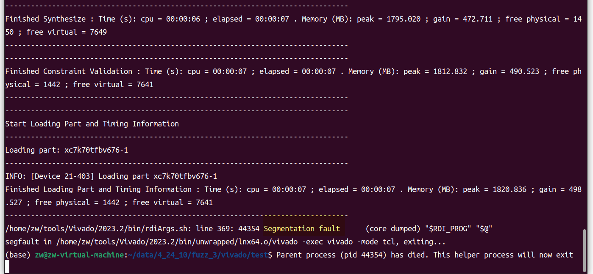

## Segmentation Fault During Synthesis in Vivado: Memory Access Issues

I encountered a segmentation fault while synthesizing design files using Vivado version 2023.2. 

Operating environment: Ubuntu 22.04 

Commands: 
```
vivado -mode tcl 
read_verilog rtl.v 
synth_design -top top
```
 The segmentation fault is as follows:

This is my Verilog design file.