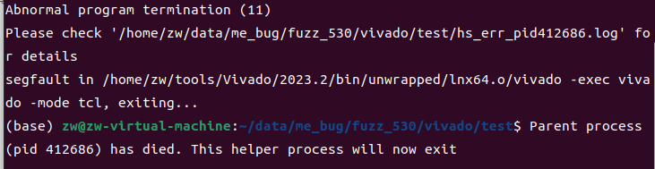
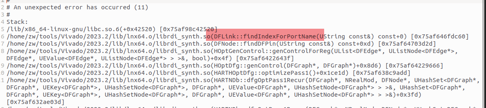

## Vivado Crash During Synthesis Due to DFLink::findIndexForPortName Errors


I encountered a crash while synthesizing design files using Vivado and a log file was generated. However, the synthesis was successful when using Yosys. 

Operating environment: Ubuntu 22.04 Vivado version: Vivado 2023.2 

```
vivado -mode tcl 
read_verilog rtl.v 
synth_design -top top
``` 


The crash phenomenon is as follows:

The log file is as follows:
