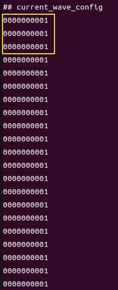
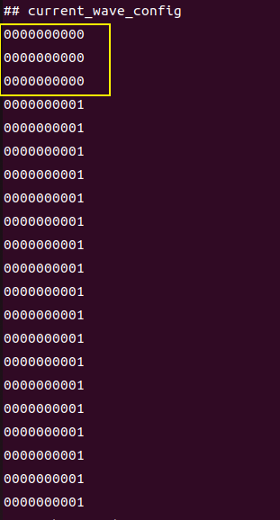

## Bit-Width Definition Inconsistencies in Vivado Synthesis Leading to Different Outputs

The following are my two original Verilog designs, which differ in the bit-width definitions of `forvar7` and `forvar5`.

```verilog
module top  (y, clk, wire3, wire2, wire1, wire0);
  output wire [(32'h9):(32'h0)] y;
  input wire [(1'h0):(1'h0)] clk;
  input wire [(2'h2):(1'h0)] wire3;
  input wire [(3'h5):(1'h0)] wire2;
  input wire signed [(3'h5):(1'h0)] wire1;
  input wire [(3'h5):(1'h0)] wire0;

  reg forvar7 = (1'h0);
  reg forvar5 = (1'h0);
  
  assign y = {forvar7};
  always
    @(posedge clk) begin
      for (forvar5 = (1'h0); (forvar5 < (1'h1)); forvar5 = (forvar5 + (1'h1)))
        begin
          if (((^(forvar5 + wire1)) ? $unsigned((&forvar5)) : wire1))
            begin

                  for (forvar7 = (1'h0); (forvar7 < (1'h1)); forvar7 = (forvar7 + (1'h1)))
                    begin
                    end
            end
        end
    end
endmodule
```

<br/>

```verilog
module top  (y, clk, wire3, wire2, wire1, wire0);
  output wire [(32'h9):(32'h0)] y;
  input wire [(1'h0):(1'h0)] clk;
  input wire [(2'h2):(1'h0)] wire3;
  input wire [(3'h5):(1'h0)] wire2;
  input wire signed [(3'h5):(1'h0)] wire1;
  input wire [(3'h5):(1'h0)] wire0;

  reg  [2:0] forvar7 = (1'h0);
  reg  [3:0] forvar5 = (1'h0);
  
  assign y = {forvar7};
  always
    @(posedge clk) begin
      for (forvar5 = (1'h0); (forvar5 < (1'h1)); forvar5 = (forvar5 + (1'h1)))
        begin
          if (((^(forvar5 + wire1)) ? $unsigned((&forvar5)) : wire1))
            begin

                  for (forvar7 = (1'h0); (forvar7 < (1'h1)); forvar7 = (forvar7 + (1'h1)))
                    begin
                    end
            end
        end
    end
endmodule
```

However, when I simulated both using the same testbench, the following inconsistencies in output were observed.




I also performed simulation tests on the original designs and found that their outputs were identical to the first type, where the bit-width is 1.

