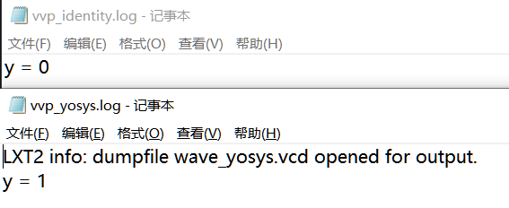

## Yosys read_verilog Command Doesn’t Respect Signed Keyword

Consider the following code. When the input is `wire0 = 6'b111101`, it is a negative number less than `forvar14`. Therefore, `reg16` takes the value of `$unsigned((-forvar9))`, which is `-0`, and the output `y` is 0. However, when using Yosys synthesis, the output result is 1.

```verilog
module top  (y, clk, wire0);
  output wire y;
  input wire clk;

  input wire signed [5:0] wire0;

  reg reg16 = (1'h0);

  reg signed [2:0]forvar14 = (1'h0);

  reg [2:0] forvar10 = (1'h0);
  reg [2:0] forvar9 = (1'h0);

  assign y = reg16;
  always
    @(posedge clk) begin
       for (forvar14 = (1'h0); (forvar14 < (1'h1)); forvar14 = (forvar14 + (1'h1)))
        begin
       reg16 = ($signed((wire0 <= forvar14)) ? $unsigned((-forvar9)) : (^~$signed(forvar10)));
       end
    end
endmodule

```
```
`include "syn_yosys.v"

`timescale 1ns / 1ps

module testbench;

  reg clk;
  reg signed [5:0] wire0;
  wire y;


  top uut (
    .y(y),
    .clk(clk),
    .wire0(wire0)
  );


  initial begin

    clk = 0;
    wire0 = 6'b111101; 


    forever #5 clk = ~clk;
  end


  initial begin

    #100;
    $display("y = %d", y);
    $finish;
  end

  initial
    begin
      $dumpfile("wave_yosys.vcd");
      $dumpvars(0, testbench);
    end
endmodule
```



